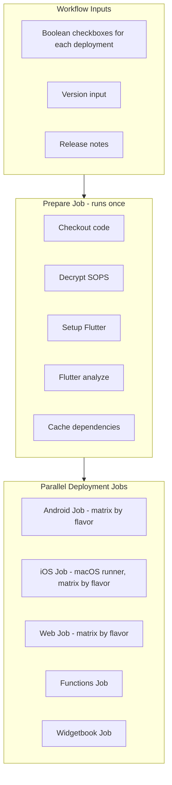

# Multi-Platform Flutter Deployment Workflow

## Current Problem

The existing `[manual_deploy.yml](~/git/snap_and_savor/.github/workflows/manual_deploy.yml)` only allows deploying one platform at a time. When deploying both Android and Web, the workflow runs twice, duplicating:

- Code checkout
- SOPS decryption
- Flutter setup
- Flutter analyze
- Firebase CLI setup

## Proposed Architecture




## Key Design Decisions

### 1. Workflow Inputs Structure

Use individual boolean inputs for maximum flexibility:

```yaml
inputs:
  # Android deployments
  deploy_android_flavor1:
    type: boolean
    default: false
  deploy_android_flavor2:
    type: boolean
    default: false
  # Web deployments  
  deploy_web_flavor1:
    type: boolean
    default: false
  # ... etc
  deploy_functions:
    type: boolean
    default: false
  deploy_widgetbook:
    type: boolean
    default: false
```

### 2. Flavor Configuration File

Create a JSON config file to centralize flavor-specific settings:

```
.github/deploy-config.json
```

This file will contain:

- Firebase App IDs per flavor/platform
- Target files per flavor
- Hosting targets per flavor
- Build arguments per flavor

### 3. Job Structure


| Job                    | Runner        | Depends On | Condition                 |
| ---------------------- | ------------- | ---------- | ------------------------- |
| `prepare`              | ubuntu-latest | -          | Always runs               |
| `build-deploy-android` | ubuntu-latest | prepare    | Any Android checkbox true |
| `build-deploy-ios`     | macos-latest  | prepare    | Any iOS checkbox true     |
| `build-deploy-web`     | ubuntu-latest | prepare    | Any Web checkbox true     |
| `deploy-functions`     | ubuntu-latest | prepare    | Functions checkbox true   |
| `deploy-widgetbook`    | ubuntu-latest | prepare    | Widgetbook checkbox true  |


### 4. Caching Strategy

- Flutter SDK cached with `subosito/flutter-action`
- Pub cache shared via `actions/cache`
- Gradle cache for Android builds
- CocoaPods cache for iOS builds

### 5. Matrix Strategy for Flavors

Each platform job uses a matrix that's dynamically filtered based on selected checkboxes:

```yaml
build-deploy-android:
  strategy:
    matrix:
      flavor: ${{ fromJson(needs.prepare.outputs.android_flavors) }}
```

## Files to Create/Modify

### New Files in `flutter_platform_kit`

1. `**.github/workflows/manual_full_deploy.yml**` - The new multi-deploy workflow
2. `**.github/deploy-config-template.json**` - Template config for flavor settings
3. `**tools/github_actions/build-deploy-flutter-aab/action.yml**` - New action for AAB builds (future Play Store support)

### Documentation

1. `**tools/github_actions/manual_full_deploy/README.md**` - Usage documentation

## Implementation Approach

### Phase 1: Core Workflow (this implementation)

- Create the multi-select workflow structure
- Support Android (APK) to Firebase App Distribution
- Support iOS to Firebase App Distribution
- Support Web to Firebase Hosting
- Support Functions deployment
- Support Widgetbook deployment
- Flavor support via config file

### Phase 2: Future Enhancements (designed for, not implemented)

- AAB builds for Google Play Store
- TestFlight deployment
- App Store submission
- Promotion workflows

## Example Usage

When a user triggers the workflow, they'll see checkboxes like:

- Deploy Android - flavor1
- Deploy Android - flavor2
- Deploy iOS - flavor1
- Deploy iOS - flavor2
- Deploy Web - flavor1
- Deploy Web - flavor2
- Deploy Functions
- Deploy Widgetbook
- Version: `1.0.0+123`
- Release Notes: `...`

Selecting multiple options runs a single workflow with shared preparation and parallel deployments.